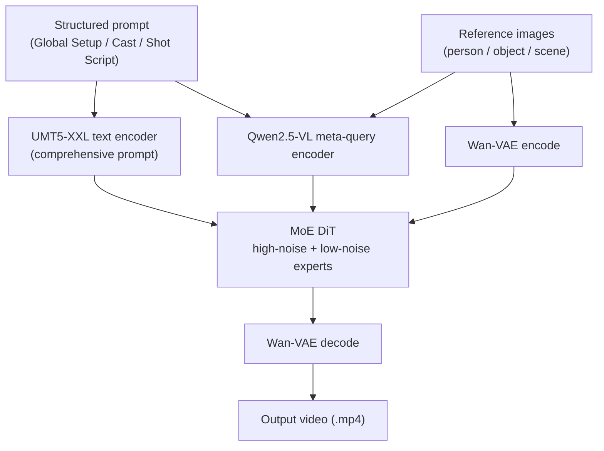
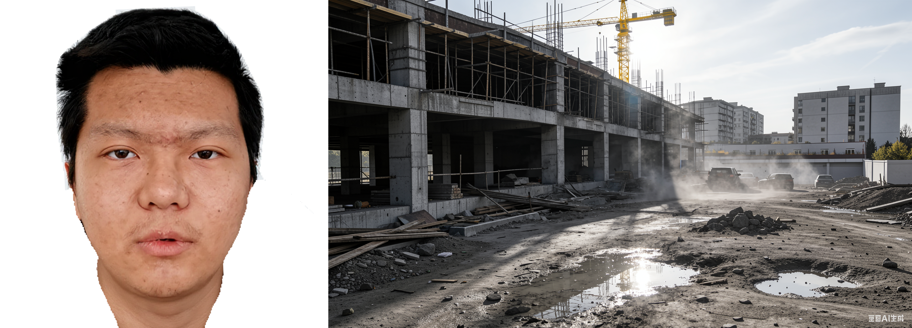

<div align="center">


<h3>Consistent Multi-Subject Video Generation via VLM-Grounded Semantic Alignment</h3>

</div>

<div align="center">
  <a href="https://github.com/Camellia997/Aura"></a> &ensp;
  <a href="https://aura-project-page.github.io"></a> &ensp;
  <a href="https://arxiv.org/pdf/2607.04311"></a> &ensp;
  <a href="https://huggingface.co/Camellia997/Aura"></a>
</div>

---

## 1. Introduction

**Aura** is a unified framework for high-fidelity, **identity-consistent multi-subject video generation**.
Given heterogeneous reference images for **people, objects, and scenes** together with a structured,
director-level prompt, Aura synthesizes a video that faithfully follows the script while preserving every
subject's identity and the surrounding scene context.

The core idea is **VLM-grounded semantic alignment**: instead of relying purely on a text encoder, Aura routes
the prompt and all reference images through a Vision-Language Model (Qwen2.5-VL) "meta-query" module. This
produces grounded semantic embeddings that tie each textual subject reference (e.g. `[PERSON_1]`, `[OBJECT_1]`,
`[SCENE_1]`) to its corresponding reference image, and injects them into a Mixture-of-Experts (high-noise /
low-noise) diffusion transformer that generates the video.

This repository contains a **minimal, self-contained inference package** distilled from the full research
codebase.

### Key features

- **Multi-subject conditioning** — combine multiple person / object / scene reference images in a single shot.
- **VLM-grounded alignment** — a Qwen2.5-VL meta-query encoder binds textual subject tags to reference images.
- **MoE diffusion backbone** — separate high-noise and low-noise 14B expert transformers switched by a noise
  `boundary`, built on the Wan 2.2 T2V-A14B architecture with a Wan-VAE and a UMT5-XXL text encoder.
- **Scales from 1 GPU to multi-node** — CPU offloading for single-GPU runs, Ulysses sequence parallelism +
  FSDP for single-node, and validation-set sharding across nodes.

### How it works



### Example results

For each case, the reference image(s) (left) and a structured prompt jointly define every subject (person,
object, scene) together with a director-level shot script; Aura then renders a ~5s clip (right) that follows the
script while keeping each subject's identity.

> The `<video>` clips below play in Markdown viewers that support HTML video (e.g. VS Code preview, most
> browsers). If a player does not render inline, click the video path to open the file directly.

#### 1. Guitarist singing in a dim bedroom

<table><tr>
<td width="32%" align="center"><b>Reference</b><br></td>
<td align="center"><b>Generated video</b><br><video src="assests/examples/demo_1.mp4" controls muted loop width="100%"></video></td>
</tr></table>

*Subjects: `PERSON_1` musician · `OBJECT_1` sunburst electric guitar · `SCENE_1` dim bedroom.*

#### 2. Ancient-style woman with a folding fan

<table><tr>
<td width="32%" align="center"><b>Reference</b><br></td>
<td align="center"><b>Generated video</b><br><video src="assests/examples/demo_2.mp4" controls muted loop width="100%"></video></td>
</tr></table>

*Subjects: `PERSON_1` ancient-style woman · `OBJECT_1` floral folding fan · `SCENE_1` candle-lit classical night scene.*

#### 3. Worker carrying cement on a construction site

<table><tr>
<td width="32%" align="center"><b>Reference</b><br></td>
<td align="center"><b>Generated video</b><br><video src="assests/examples/demo_3.mp4" controls muted loop width="100%"></video></td>
</tr></table>

*Subjects: `PERSON_1` construction worker · `SCENE_1` dusty construction site.*

#### 4. Ink-wash Taiji staff on a misty lake

<table><tr>
<td width="32%" align="center"><b>Reference</b><br></td>
<td align="center"><b>Generated video</b><br><video src="assests/examples/demo_4.mp4" controls muted loop width="100%"></video></td>
</tr></table>

*Subjects: `PERSON_1` middle-aged man · `OBJECT_1` wooden long staff · `SCENE_1` misty mountain lake.*

#### 5. Hanging a shirt on a golden-hour balcony

<table><tr>
<td width="32%" align="center"><b>Reference</b><br></td>
<td align="center"><b>Generated video</b><br><video src="assests/examples/demo_5.mp4" controls muted loop width="100%"></video></td>
</tr></table>

*Subjects: `PERSON_1` young woman · `SCENE_1` vine-covered golden-hour balcony.*

#### 6. Woman with a camel scarf by the window

<table><tr>
<td width="32%" align="center"><b>Reference</b><br></td>
<td align="center"><b>Generated video</b><br><video src="assests/examples/demo_6.mp4" controls muted loop width="100%"></video></td>
</tr></table>

*Subjects: `PERSON_1` young woman · `SCENE_1` bright floor-to-ceiling window room.*

#### 7. Cyberpunk mech "Nezha" on a neon street

<table><tr>
<td width="32%" align="center"><b>Reference</b><br></td>
<td align="center"><b>Generated video</b><br><video src="assests/examples/demo_7.mp4" controls muted loop width="100%"></video></td>
</tr></table>

*Subjects: `PERSON_1` cyberpunk Nezha · `SCENE_1` futuristic rainy city.*

### Qualitative comparison

Aura is compared against six recent multi-subject / reference-driven video generation baselines —
**Kaleido, HuMo, MAGREF, RefAlign, and Wan 2.7** — using the same reference image and prompt per case. Across
these comparisons Aura more faithfully preserves each subject's identity and the scene context while following
the director-level script.

#### Comparison 1

<table>
<tr><td colspan="3" align="center"><b>Reference</b><br></td></tr>
<tr>
<td align="center"><b>Aura (Ours)</b><br><video src="assests/comparison/ours/compare_1.mp4" controls muted loop width="100%"></video></td>
<td align="center"><b>Kaleido</b><br><video src="assests/comparison/kaleido/compare_1.mp4" controls muted loop width="100%"></video></td>
<td align="center"><b>HuMo</b><br><video src="assests/comparison/humo/compare_1.mp4" controls muted loop width="100%"></video></td>
</tr>
<tr>
<td align="center"><b>MAGREF</b><br><video src="assests/comparison/magref/compare_1.mp4" controls muted loop width="100%"></video></td>
<td align="center"><b>RefAlign</b><br><video src="assests/comparison/refalign/compare_1.mp4" controls muted loop width="100%"></video></td>
<td align="center"><b>Wan 2.7</b><br><video src="assests/comparison/wan2_7/compare_1.mp4" controls muted loop width="100%"></video></td>
</tr>
</table>

#### Comparison 2

<table>
<tr><td colspan="3" align="center"><b>Reference</b><br></td></tr>
<tr>
<td align="center"><b>Aura (Ours)</b><br><video src="assests/comparison/ours/compare_2.mp4" controls muted loop width="100%"></video></td>
<td align="center"><b>Kaleido</b><br><video src="assests/comparison/kaleido/compare_2.mp4" controls muted loop width="100%"></video></td>
<td align="center"><b>HuMo</b><br><video src="assests/comparison/humo/compare_2.mp4" controls muted loop width="100%"></video></td>
</tr>
<tr>
<td align="center"><b>MAGREF</b><br><video src="assests/comparison/magref/compare_2.mp4" controls muted loop width="100%"></video></td>
<td align="center"><b>RefAlign</b><br><video src="assests/comparison/refalign/compare_2.mp4" controls muted loop width="100%"></video></td>
<td align="center"><b>Wan 2.7</b><br><video src="assests/comparison/wan2_7/compare_2.mp4" controls muted loop width="100%"></video></td>
</tr>
</table>

---

## 2. Installation

The environment targets **CUDA 12.4** and PyTorch 2.5. An install script creates a fresh conda environment and
installs everything inside it.

### Prerequisites

- `conda` (miniconda / anaconda) on your `PATH`
- an NVIDIA driver that supports CUDA 12.4
- a C/C++ toolchain (for building `flash-attn`)

### One-command setup

```bash
bash jobs/install.sh
conda activate aura
```

You can customize the environment name / Python version:

```bash
ENV_NAME=aura PYTHON_VERSION=3.10 bash jobs/install.sh
conda activate aura
```

### What the script installs

`jobs/install.sh` performs the following inside the new conda env:

1. **PyTorch (CUDA 12.4)** — `torch==2.5.0`, `torchvision==0.20.0`, `torchaudio==2.5.0` from the `cu124` wheel
   index, plus a pinned `nvidia-cublas-cu12==12.4.5.8`.
2. **Transformers & Diffusers** — `transformers==4.57.1` (for Qwen2.5-VL) and a pinned `diffusers` commit.
3. **Other Python dependencies** — from [`requirements.txt`](requirements.txt) (numpy, scipy, einops, opencv,
   pillow, imageio, safetensors, accelerate, sentencepiece, ftfy, regex, decord, ...).
4. **flash-attention** — `flash_attn==2.7.4.post1 --no-build-isolation` (built last, against the installed torch).

> If your machine needs an HTTP(S) proxy to reach PyPI, uncomment and edit the proxy lines near the top of
> `jobs/install.sh`.

---

## 3. Model weights

Download / place the following before running inference, and point the launch scripts at them:

| Script variable | Contents |
|---|---|
| `CKPT_DIR` | Base checkpoints: UMT5-XXL text encoder (`models_t5_umt5-xxl-enc-bf16.pth`), its tokenizer (`google/umt5-xxl`), and the Wan-VAE (`Wan2.1_VAE.pth`). |
| `HIGH_NOISE_MODEL_DIR` | High-noise expert DiT weights (`*.bin`), from the finetuned Aura repo (`Camellia997/Aura`). |
| `LOW_NOISE_MODEL_DIR` | Low-noise expert DiT weights (`*.bin`), from the finetuned Aura repo (`Camellia997/Aura`). |
| `VLM_DIR` | Qwen2.5-VL model used by the meta-query encoder (local path or HF id, e.g. `Qwen/Qwen2.5-VL-3B-Instruct`). |

### Download

Use the helper script to fetch the base checkpoints (`Wan-AI/Wan2.2-T2V-A14B`), the meta-query VLM backbone
(`Qwen/Qwen2.5-VL-3B-Instruct`), and the finetuned Aura expert weights (`Camellia997/Aura`) from the Hugging
Face Hub:

```bash
# download all three into ./weights
bash jobs/download.sh

# custom output directory
OUTPUT_DIR=/data/weights bash jobs/download.sh

# only one model
MODELS=wan  bash jobs/download.sh
MODELS=qwen bash jobs/download.sh
MODELS=aura bash jobs/download.sh

# use a mirror (e.g. mainland China) + the accelerated backend
HF_ENDPOINT=https://hf-mirror.com ENABLE_HF_TRANSFER=1 bash jobs/download.sh

# gated / private repositories
HF_TOKEN=hf_xxx bash jobs/download.sh
```

Configuration is passed via environment variables: `OUTPUT_DIR` (default `weights`), `MODELS`
(`all`/`wan`/`qwen`/`aura`), `MAX_WORKERS`, `ENABLE_HF_TRANSFER`, `HF_ENDPOINT`, `HF_TOKEN`. (You can also call
`python download.py --help` directly.) When it finishes, the script prints the exact `CKPT_DIR` /
`HIGH_NOISE_MODEL_DIR` / `LOW_NOISE_MODEL_DIR` / `VLM_DIR` values to paste into `jobs/infer_*.sh`.

> `Wan-AI/Wan2.2-T2V-A14B` provides `CKPT_DIR` (T5 + VAE + tokenizer); its bundled `high_noise_model/` and `low_noise_model/` are the original Wan experts. 
> `Camellia997/Aura` provides the finetuned Aura experts —
> point `HIGH_NOISE_MODEL_DIR` / `LOW_NOISE_MODEL_DIR` at `weights/Aura/high_noise_model` / `weights/Aura/low_noise_model` for Aura results.

---

## 4. Prepare the test set

Inference is driven by a JSON file (a list of samples). A ready-to-run, fully self-contained example with 50
cases and all referenced images is provided at:

```
metafiles/validation/inference-samples.json
```

All image paths in this file are **relative to the project root** and the images live under
`metafiles/validation/` (`processed_ugc/face_segmented/`, `processed_ugc/segmented/`, `scene_images/`), so it
works out of the box.

### JSON schema (per entry)

| Field | Required | Description |
|---|---|---|
| `videoid` | yes | Output file stem (`<videoid>.mp4` / `.png` / `.txt`). |
| `enhanced_prompt_id_reference.visual_description` | yes | 2-element list: `[0]` = subject-referenced prompt, `[1]` = comprehensive prompt. |
| `ref_image_path` | yes (may be `null`) | Single reference image (fallback when `mul_ref_image_path` is null). |
| `mul_ref_image_path` | yes (may be `null`) | List of person reference images. |
| `ff_image_path` | yes (may be `null`) | First-frame image; `null` for `ref` mode. |
| `ref_ids` | optional | `{"person": [...], "object": [...], "scene": [...]}` id assignment. |
| `seg_object_image_path` | optional | List of object reference images (ids offset by +100). |
| `scene_path` | optional | List of scene reference images (ids offset by +200). |
| `seed` | optional | Per-sample random seed (defaults to `--base_seed`). |

### Prompt format

The prompt is a structured, director-level script. Subjects are declared and then referenced with tags like
`[PERSON_1]`, `[OBJECT_1]`, `[SCENE_1]`:

```text
[Global Setup]
Overall Scene: ...
Global Style: ...

[Cast & Setting Introduction]
PERSON_1: <appearance / identity>
OBJECT_1: <object description>
SCENE_1: <scene description>

[Shot Narrative Script]
(Shot 1)
Time Range: [0s - 5.0s]
... references [PERSON_1] holding [OBJECT_1] in [SCENE_1] ...
```

A complete example prompt (case 3 above):

```text
[Global Setup]
Overall Scene: A young man wearing work clothes covered in cement dust carries a bag of cement on a construction site, then sets it down.
Global Style: Belongs to the realistic film and television lens style, with a strong sense of documentary, shaping characters through everyday scenes, full of urban atmosphere and narrative tension.

[Cast & Setting Introduction]

PERSON_1:
A young man wearing work clothes stained with cement dust.

SCENE_1:
A dusty construction site with exposed steel-reinforced concrete frames, a yellow tower crane in the background, and puddles on the ground reflecting harsh daylight.

[Shot Narrative Script]

(Shot 1)
Time Range: [0s - 5.0s]
In the scene of [SCENE_1], [PERSON_1] carries a bag of cement, shot in a slightly upward close-up. The camera slowly tilts up from [PERSON_1]'s cement-dusted work clothes to [PERSON_1]'s left profile. [PERSON_1]'s eyes are calm as still water, jawline tensed, carrying the cement bag with one hand—shoulders trembling slightly but steps steady.
```

---

## 5. Inference

All launch scripts live under `jobs/` and must be run from the project root (they `cd` there automatically).
Before running, open the chosen script and fill in the path variables at the top (`CKPT_DIR`,
`HIGH_NOISE_MODEL_DIR`, `LOW_NOISE_MODEL_DIR`, `VLM_DIR`, `CSV_FILE`). To use the bundled test set, set:

```bash
CSV_FILE="metafiles/validation/inference-samples.json"
```

### 5.1 Single GPU

Runs with CPU offloading (`--offload_model True --convert_model_dtype`), no FSDP, no sequence parallelism.

```bash
conda activate hyvideo-edit
bash jobs/infer_single_gpu.sh

# choose a specific GPU
CUDA_VISIBLE_DEVICES=3 bash jobs/infer_single_gpu.sh
```

### 5.2 Single node, multiple GPUs

8-way Ulysses sequence parallelism + FSDP over the GPUs on one machine.

```bash
bash jobs/infer_single_node.sh

# fewer GPUs (GPUS_PER_NODE must divide num_heads = 40, e.g. 4)
GPUS_PER_NODE=4 CUDA_VISIBLE_DEVICES=0,1,2,3 bash jobs/infer_single_node.sh
```

`GPUS_PER_NODE` is passed to both `--nproc_per_node` and `--ulysses_size`, so all GPUs on the node form one
sequence-parallel group.

### 5.3 Multiple nodes, multiple GPUs

Each node runs sequence parallel over its own GPUs, and the test set is **sharded across nodes**. Launch the
same script on **every** node with a shared `MASTER_ADDR` / `MASTER_PORT` and `NNODES`, but a **unique**
`NODE_RANK` (0..NNODES-1).

```bash
# 2 nodes x 8 GPUs, master IP = 10.0.0.1

# ---- on node 0 ----
NNODES=2 NODE_RANK=0 MASTER_ADDR=10.0.0.1 MASTER_PORT=29500 bash jobs/infer_multi_node.sh

# ---- on node 1 ----
NNODES=2 NODE_RANK=1 MASTER_ADDR=10.0.0.1 MASTER_PORT=29500 bash jobs/infer_multi_node.sh
```

If your scheduler already exports `MASTER_ADDR` / `MASTER_PORT` / `NODE_RANK` / `NNODES`, you may omit them
(the script reads them via `${VAR:-default}`).

### 5.4 Direct invocation

The scripts wrap `inference.py`. You can call it directly, e.g. single GPU:

```bash
python inference.py \
    --size 720*1280 \
    --ckpt_dir  <CKPT_DIR> \
    --high_noise_model_dir <HIGH_NOISE_MODEL_DIR> \
    --low_noise_model_dir  <LOW_NOISE_MODEL_DIR> \
    --vlm_dir Qwen/Qwen2.5-VL-3B-Instruct \
    --csv_file metafiles/validation/inference-samples.json \
    --save_dir results/single_gpu \
    --gen_mode ref --boundary 0.875 --base_seed 1024 --sample_shift 6.0 \
    --offload_model True --convert_model_dtype --ulysses_size 1 --nodes 1 --node_rank 0
```

### 5.5 Command-line arguments

| Argument | Default | Description |
|---|---|---|
| `--size` | `720*1280` | Output resolution `width*height` (`720*1280`, `1280*720`, `480*832`, `832*480`). |
| `--frame_num` | `81` | Number of frames (must be `4n+1`). |
| `--sample_steps` | `40` | Diffusion sampling steps. |
| `--sample_solver` | `unipc` | Solver: `unipc` or `dpm++`. |
| `--sample_shift` | `12.0` | Flow-matching schedule shift. |
| `--boundary` | `0.875` | Timestep boundary: `t > boundary` uses the high-noise expert, else low-noise. |
| `--base_seed` | `1024` | Random seed (overridden by per-sample `seed`). |
| `--gen_mode` | `ref` | Generation mode: `ref` (reference-driven), `ff`, `lf`, `nul`. |
| `--slg` | `-1` | Skip-Layer-Guidance layer (`-1` disables). |
| `--guide_scale_text` | `5.0 5.0` | Text CFG scale `(low_noise, high_noise)`. |
| `--guide_scale_img` | `5.0 3.0` | Image CFG scale `(low_noise, high_noise)`. |
| `--ckpt_dir` | — | Base checkpoints (T5 + VAE). |
| `--high_noise_model_dir` / `--low_noise_model_dir` | — | Expert DiT weight directories. |
| `--vlm_dir` | `Qwen/Qwen2.5-VL-3B-Instruct` | Qwen2.5-VL for the meta-query encoder. |
| `--csv_file` | — | Validation JSON. |
| `--save_dir` / `--log_file` | `results` / `results/logging.txt` | Output locations. |
| `--ulysses_size` | `1` | Ulysses sequence-parallel group size (= GPUs per node when >1). |
| `--t5_fsdp` / `--dit_fsdp` | off | FSDP sharding for the T5 encoder / DiT. |
| `--t5_cpu` | off | Keep the T5 encoder on CPU. |
| `--offload_model` | auto | Offload idle expert to CPU between steps (auto: on for 1 GPU). |
| `--convert_model_dtype` | off | Cast DiT params to `bfloat16`. |
| `--apply_rope_in_selfattn` | `False` | RoPE application mode in self-attention. |
| `--nodes` / `--node_rank` | `1` / `0` | Number of nodes / rank of this node (for cross-node sharding). |

---

## 6. Outputs

For each sample, results are written to `--save_dir`:

- `<videoid>.mp4` — the generated video (16 fps by default).
- `<videoid>.png` — the reference image(s) (multiple references concatenated horizontally).
- `<videoid>.txt` — the prompt used.

Already-generated `<videoid>.mp4` files are skipped on restart, so interrupted runs resume automatically.

---

## 7. Tips & notes

- **Memory**: for a single GPU keep `--offload_model True --convert_model_dtype`. For multi-GPU, enable
  `--dit_fsdp --t5_fsdp` and set `--ulysses_size` to the number of GPUs per node.
- **`ulysses_size` constraint**: it must evenly divide the number of attention heads (`num_heads = 40`), e.g.
  1, 2, 4, 5, 8.
- **Resolution / duration**: `--size` sets the frame resolution and `--frame_num` (4n+1) the length; the model
  targets ~5s clips at 16 fps.
- **Reproducibility**: set `--base_seed` (or a per-sample `seed` in the JSON).

---

## 8. Acknowledgements

This inference package builds on the **Wan 2.2 (T2V-A14B)** architecture (VAE, UMT5-XXL text encoder, MoE
diffusion transformer) and uses **Qwen2.5-VL** as the vision-language backbone for semantic grounding.
